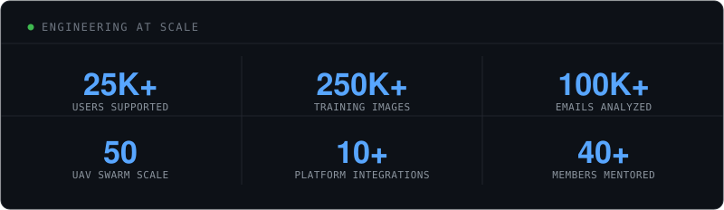

<div align="center">

# ANURAG ANAND

*software engineer / builder*

Building software, systems and experiments across full-stack engineering, AI/ML, infrastructure and security.


</div>

<br/>

## `whoami`

CSE undergraduate at SRM Institute of Science & Technology (2024–2028, CGPA 9.88), working across full-stack engineering, backend systems, AI/ML, cloud infrastructure and security.

Comfortable moving between production engineering, applied research and experimental prototyping — the six systems below span all three.

`FULL-STACK` `AI / ML` `BACKEND` `CLOUD` `SECURITY` `SYSTEM DESIGN`

**Built across:** `Research Intern @ IIIT Kottayam` `Full-Stack Developer @ Inxtinct Security (London)` `Software Developer @ Wegbruck` `SWE Intern @ SRMIST` `Backend Developer Intern @ Yahweh Software Solutions`

<br/>

## Currently building

**Workaholic** — a productivity and academic scheduling system, designed around the actual mess of student schedules rather than as another to-do list.

```
recurring courses + deadlines + shifting constraints → a generated semester schedule
```

`academic scheduling` `recurring schedules` `semester management` `calendar generation` — actively evolving, so no numbers here yet.

<br/>

## The ecosystem

Six systems at different stages — some shipped, some research, some private. Described here for what they do, not sold.

<br/>

### Secure UAV Command & Control Platform


A C++/Qt6 command-and-control platform for UAV swarms of up to 50 aircraft, integrating QGroundControl, MAVLink telemetry, PostgreSQL, collision avoidance and Docker-based simulation, with post-quantum security layered on top: DTLS, ChaCha20-Poly1305/AES-256-GCM, blockchain-backed logging and Byzantine-robust federated learning across the swarm.

In simulation: 100% rejection of unauthorized nodes across 15 concurrent rogue actors, sub-140ms logging latency, and a 32-percentage-point accuracy gain under 50% malicious-node conditions.

`C` `C++` `Qt6` `PostgreSQL` `Protobuf` `MAVLink` `DTLS` `Blockchain` `ML-KEM` `ML-DSA` `Docker`

---

### AgniShakti — AI Fire Detection Platform


A fire-detection platform built on YOLOv8, trained on 250,000+ images, reaching 90%+ detection accuracy for real-time CCTV analytics with automated emergency alerts — architected as a production-oriented SaaS system rather than a lab demo.

`Python` `YOLOv8` `PyTorch` `TensorFlow` `OpenCV` `React.js` `Next.js` `Flask` `WebSockets`

---

### Tamil Nadu / SRMIST Digital Twin


Led a one-month interdisciplinary build modelling the SRMIST Chennai campus in high fidelity — GIS through Cesium, drone-based photogrammetry through Meshroom, and Unity-based 3D simulation. Layered on top: a 6G-networked, AI-native intelligence layer using computer vision for crowd-flow tracking and agentic, policy-based decision support for real-time bottleneck mitigation.

`GIS` `Cesium` `Meshroom` `Unity` `6G Networking` `Computer Vision` `Agentic AI`

---

### Hyper-Realistic Handwriting Synthesis

Research into generating realistic, structured handwriting through machine learning and computer vision — early-stage and experimental by nature.

```
handwriting sample → model → structured, generated strokes
```

`Machine Learning` `Computer Vision` `Research`

---

### Secure Digital Signing Platform

An end-to-end digital signing platform: AES-256 encryption, role-based access control, secure hashing and authenticated approval workflows, backed by audit logging and encrypted document management. Hardened against 12 simulated attack scenarios; processed 100+ documents through the approval workflow in testing.

```
document → hash → encrypt → approve → audit trail
```

`Next.js` `Firebase` `AES-256` `RBAC` `Secure Hashing`

<br/>

## Engineering at scale



*10+ national and university hackathon wins &middot; 5+ workshops and bootcamps organized &middot; 3 government-funded research initiatives as Lead Software Developer & Architect &middot; Founder, Accemberg Technologies*

<br/>

## The toolbox

**Languages**
`Java` `Python` `C++` `JavaScript` `TypeScript` `SQL` `C`

**Application development**
`Node.js` `Express.js` `Next.js` `React.js` `Flask` `Tauri` `HTML5` `CSS3`

**Databases**
`MySQL` `PostgreSQL` `MongoDB` `Firebase` `Redis` `Prisma ORM`

**Cloud & DevOps**
`AWS` `GCP` `Docker` `Git` `GitHub Actions` `CI/CD` `Linux` `Vercel`

**APIs & security**
`REST APIs` `WebSockets` `JWT` `OAuth 2.0` `AES-256` `RBAC` `DTLS`

**AI / ML**
`PyTorch` `TensorFlow` `OpenCV` `Scikit-learn` `Computer Vision` `NLP` `Large Language Models`

<br/>

## Research & community

**ACM SIGKDD, SRMIST** — Research & Development Head. Mentored 40+ members across machine learning, deep learning, NLP, generative AI, CNNs, ANNs, YOLO and RAG, and organized 5+ technical workshops, hackathons and bootcamps.

**Google Developer Groups** — Technical Team Member, working on full-stack and cloud-native software projects alongside other developer initiatives.

<br/>

## Currently exploring

`system design` `distributed systems` `AI-native applications` `secure software` `developer tooling`

<br/>

<div align="center">


*This page reflects work in progress, not a finished product.*

</div>
