



  <em>Building software, systems and experiments across full-stack engineering, AI/ML, infrastructure and security.</em>


<h2 align="center"><code>whoami</code></h2>

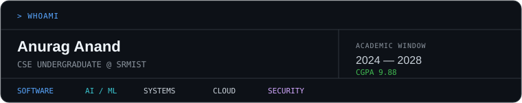

<h2 align="center">Currently building</h2>

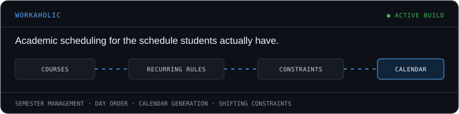

<h2 align="center">The ecosystem</h2>

Six systems at different stages &mdash; some shipped, some research, some private. Described for what they do, not sold.

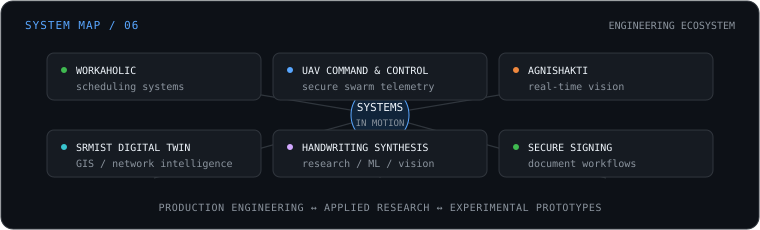

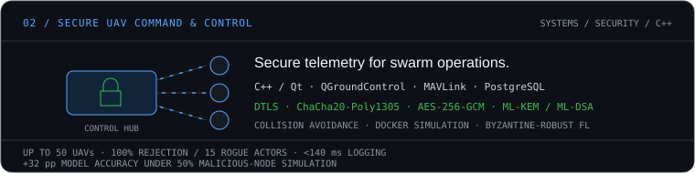


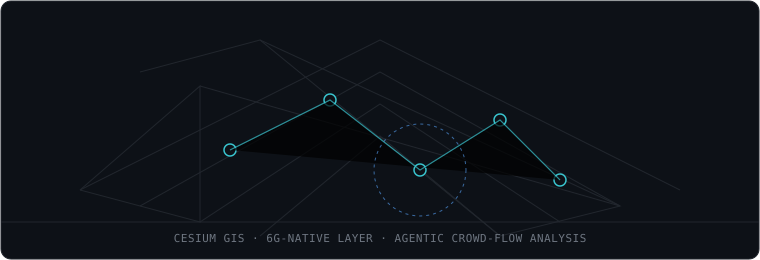

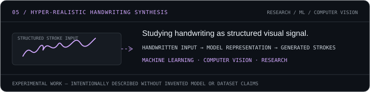

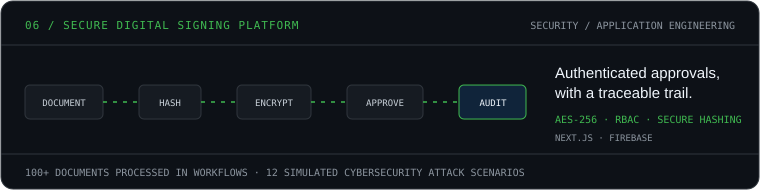

<h2 align="center">Toolbox</h2>

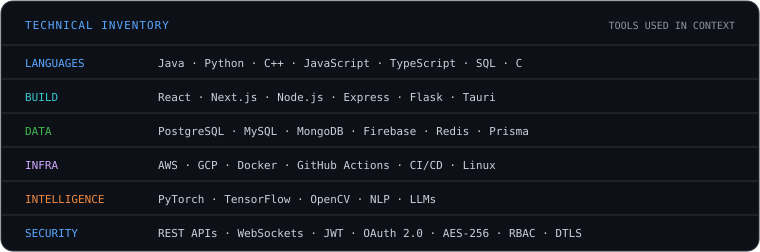

<h2 align="center">Research / community</h2>

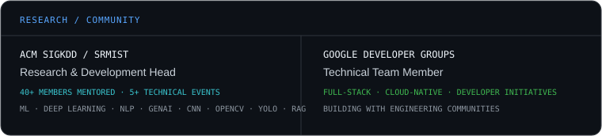

<h2 align="center">Currently exploring</h2>

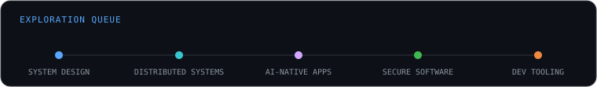


